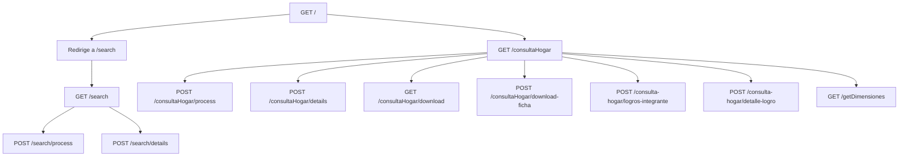

# Documentación Técnica - App Consulta Hogar

## Descripción General
Aplicación web para consulta y gestión de información de hogares, con funcionalidades de:
- Búsqueda por folio o documento
- Visualización de detalles de hogares e integrantes
- Generación de fichas en PDF
- Gestión de logros y dimensiones

## Tecnologías
- **PHP**: 8.2
- **Laravel**: 11.31
- **Base de datos**: MySQL (con conexión a múltiples esquemas)
- **Generación de PDF**: DomPDF
- **Frontend**: Blade, TailwindCSS

## Endpoints Principales

## Flujos Principales

### 1. Consulta de Hogar
1. Usuario ingresa folio o documento
2. Sistema consulta en:
   - `familiam_modulo_cif.t1_principalhogar`
   - `familiam_modulo_cif.t1_principalintegrantes`
3. Muestra resultados en tabla interactiva

### 2. Generación de Ficha PDF
1. Usuario solicita ficha PDF
2. Sistema:
   - Consulta datos del hogar
   - Consulta logros (usando stored procedures)
   - Genera PDF con DomPDF
3. Descarga automática del PDF

## Estructura de Base de Datos
Principales tablas relacionadas:
- `t1_principalhogar`: Datos principales del hogar
- `t1_principalintegrantes`: Integrantes del hogar
- `t_historicoestacionestadoservidor`: Histórico de estados
- `t4_dimensionlogros`: Dimensiones y logros

## Modelos Relacionados
- `ConsultaHogar.php`: Modelo principal
- `Integrante.php`: Modelo de integrantes
